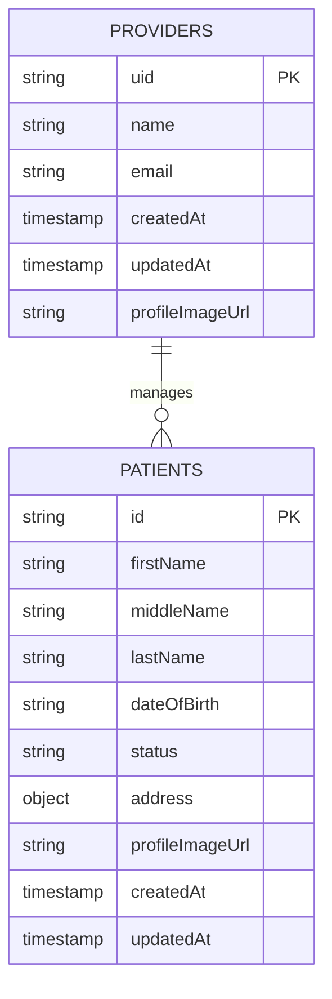

# PatientPilot

## Table of Contents

- [Testing the Live App](#testing-the-live-app)
- [Running the Project Locally](#running-the-project-locally)
  - [Backend - Node.js API & Firebase](#backend---nodejs-api--firebase)
  - [Frontend](#frontend)
- [Patient Management API Endpoints](#patient-management-api-endpoints)
  - [Firebase Authentication](#firebase-authentication)
  - [Providers](#providers)
  - [Patients](#patients)
- [Error Responses](#error-responses)
- [Database Schema](#database-schema)
- [Built With](#built-with)

---

## Testing the Live App

You can test the live application at the following URL:

[https://patient-pilot.onrender.com/](https://patient-pilot.onrender.com/)

Live API endpoint:
[https://patient-pilot-api.onrender.com/](https://patient-pilot-api.onrender.com/)

## Running the Project Locally

### Backend - Node.js API & Firebase

1. **Install Node.js and pnpm**  
   Make sure [Node.js](https://nodejs.org/) (>= 18.0.0) and [pnpm](https://pnpm.io/installation) are installed on your system.

2. **Create Environment Files**  
   Create a `.env` file in the root directory with the following configuration:

   ```env
   PORT=3000
   NODE_ENV=development
   API_PREFIX=/api/
   ```

3. **Firebase Setup**

   1. **Go to Firebase Console**  
      [https://console.firebase.google.com](https://console.firebase.google.com)

   2. **Select Your Project**

   3. **Go to Project Settings**  
      Click the gear icon next to "Project Overview" > Select **Project settings**

   4. **Open the “Service accounts” tab**

   5. Click **"Generate new private key"**

   6. Confirm and download the file. Name this `firebase-credentials.json` in the root directory

4. **Install Dependencies**  
   Install the required dependencies:

   ```bash
   pnpm install
   ```

5. **Build the Application**  
   Compile TypeScript to JavaScript:

   ```bash
   pnpm build
   ```

6. **Start the Server**  
   Run the application:

   ```bash
   pnpm start
   ```

   For development with hot reload:

   ```bash
   pnpm dev
   ```

---

### Frontend

1. **Navigate to Frontend Directory**  
   Change to the frontend directory:

   ```bash
   cd src/frontend
   ```

2. **Install Dependencies**  
   Install the required dependencies:

   ```bash
   pnpm install
   ```

3. **Create Environment File**  
   Create a `.env` file in the frontend directory:

   ```env
   VITE_API_BASE_URL=http://localhost:3000
   VITE_FIREBASE_API_KEY=<Firebase API key>
   VITE_DEFAULT_USER_EMAIL=<Default Firebase user email>
   VITE_DEFAULT_USER_PASSWORD=<Default Firebase user password>
   VITE_GOOGLE_API_KEY=<Google API key>
   ```

   For the Google Autocomplete address input:

   1. Go to [Google Cloud Console](https://console.cloud.google.com/)
   2. Click project dropdown → **New Project**
   3. Enter project name → Click **Create**
   4. Select the project

   5. Enable APIs:

      - [Places API](https://console.cloud.google.com/apis/library/places-backend.googleapis.com)
      - [Maps JavaScript API](https://console.cloud.google.com/apis/library/maps-backend.googleapis.com)

   6. Go to [Credentials page](https://console.cloud.google.com/apis/credentials)
      - Click **Create Credentials** → **API key**
      - Copy the key

4. **Run the Frontend**  
   Start the frontend development server:

   ```bash
   pnpm dev
   ```

5. **Access the Frontend**  
   Open your browser and navigate to `http://localhost:5173/`.

---

## Patient Management API Endpoints

### Firebase Authentication

All endpoints require a Firebase ID token in the `Authorization` header for authentication.

**Header Example**:

```
Authorization: Bearer <firebase_id_token>
```

If the token is invalid or missing, the API will return:

```json
{
  "error": "Invalid authentication token"
}
```

---

## Sign In

**Endpoint**: `POST https://identitytoolkit.googleapis.com/v1/accounts:signInWithPassword?key={{firebase_api_key}}`

**Description**: Authenticates a Firebase user using email and password credentials.

**Request Body**:

```json
{
  "email": "demo@clinic.test",
  "password": "your_password",
  "returnSecureToken": true
}
```

**Response**:

```json
{
  "kind": "identitytoolkit#VerifyPasswordResponse",
  "localId": "provider_uid_123",
  "email": "demo@clinic.test",
  "displayName": "Demo Provider",
  "idToken": "eyJhbGciOiJSUzI1NiIsImtpZCI6IjE2NzAyNjk...",
  "registered": true,
  "refreshToken": "AMf-vBxUxdZw_XQFqQNF...",
  "expiresIn": "3600"
}
```

## Providers

### 1. **Get Provider Profile**

**Endpoint**: `GET /api/providers/profile`

**Description**: Retrieves the authenticated provider's profile information.

**Response**:

```json
{
  "email": "demo@clinic.test",
  "createdAt": {
    "_seconds": 1750838612,
    "_nanoseconds": 485000000
  },
  "updatedAt": {
    "_seconds": 1750838612,
    "_nanoseconds": 485000000
  },
  "name": "Demo Provider"
}
```

---

### 2. **Update Provider Profile**

**Endpoint**: `PUT /api/providers/profile`

**Description**: Updates the authenticated provider's profile information.

**Request Body**:

```json
{
  "email": "demo@clinic.test",
  "createdAt": {
    "_seconds": 1750838612,
    "_nanoseconds": 485000000
  },
  "updatedAt": {
    "_seconds": 1750838612,
    "_nanoseconds": 485000000
  },
  "name": "Demo Provider"
}
```

**Response**:

```json
{
  "message": "Provider updated successfully"
}
```

---

## Patients

### 1. **Get All Patients**

**Endpoint**: `GET /api/patients`

**Description**: Retrieves all patients for the authenticated provider with optional filtering and pagination.

**Query Parameters**:

- `status` (optional): Filter by patient status (`INQUIRY`, `ONBOARDING`, `ACTIVE`, `CHURNED`).
- `limit` (optional, default: 50): Maximum number of patients to return.
- `offset` (optional, default: 0): Number of patients to skip.
- `orderBy` (optional, default: lastName): Field to sort by.

**Response**:

```json
{
  "patients": [
    {
      "id": "patient123",
      "firstName": "John",
      "middleName": "Michael",
      "lastName": "Doe",
      "dateOfBirth": "1985-01-15",
      "status": "ACTIVE",
      "address": {
        "formatted_address": "123 Main St, New York, NY 10001, USA",
        "address_components": [
          {
            "long_name": "123",
            "short_name": "123",
            "types": ["street_number"]
          }
        ]
      },
      "profileImageUrl": "https://example.com/john-doe.jpg",
      "createdAt": {
        "_seconds": 1750931014,
        "_nanoseconds": 736000000
      },
      "updatedAt": {
        "_seconds": 1750931014,
        "_nanoseconds": 736000000
      }
    }
  ],
  "pagination": {
    "limit": 50,
    "offset": 0,
    "count": 1,
    "hasMore": false
  }
}
```

---

### 2. **Get Patient by ID**

**Endpoint**: `GET /api/patients/:id`

**Description**: Retrieves a specific patient by their ID.

**Response**:

```json
{
  "id": "patient123",
  "firstName": "John",
  "middleName": "Michael",
  "lastName": "Doe",
  "dateOfBirth": "1985-01-15",
  "status": "ACTIVE",
  "address": {
    "formatted_address": "123 Main St, New York, NY 10001, USA",
    "address_components": []
  },
  "profileImageUrl": "https://example.com/john-doe.jpg",
  "createdAt": {
    "_seconds": 1750838612,
    "_nanoseconds": 485000000
  },
  "updatedAt": {
    "_seconds": 1750838612,
    "_nanoseconds": 485000000
  }
}
```

---

### 3. **Create Patient**

**Endpoint**: `POST /api/patients`

**Description**: Creates a new patient record.

**Request Body**:

```json
{
  "firstName": "John",
  "middleName": "Michael",
  "lastName": "Doe",
  "dateOfBirth": "1985-01-15T00:00:00.000Z",
  "status": "ACTIVE",
  "address": {
    "formatted_address": "123 Main St, New York, NY 10001, USA",
    "address_components": [],
    "place_id": "ChIJd8BlQ2BZwokRAFUEcm_qrcA"
  },
  "profileImageUrl": "https://example.com/john-doe.jpg"
}
```

**Response**:

```json
{
  "id": "patient123",
  "firstName": "John",
  "middleName": "Michael",
  "lastName": "Doe",
  "dateOfBirth": "1985-01-15",
  "status": "ACTIVE",
  "address": {
    "formatted_address": "123 Main St, New York, NY 10001, USA",
    "address_components": []
  },
  "profileImageUrl": "https://example.com/john-doe.jpg",
  "createdAt": {
    "_seconds": 1750838612,
    "_nanoseconds": 485000000
  },
  "updatedAt": {
    "_seconds": 1750838612,
    "_nanoseconds": 485000000
  }
}
```

---

### 4. **Update Patient**

**Endpoint**: `PUT /api/patients/:id`

**Description**: Updates an existing patient record. All fields are optional.

**Request Body**:

```json
{
  "firstName": "John",
  "middleName": "Michael",
  "lastName": "Doe",
  "dateOfBirth": "1985-01-15T00:00:00.000Z",
  "status": "ACTIVE",
  "address": {
    "formatted_address": "456 Oak Ave, Los Angeles, CA 90210, USA",
    "address_components": []
  },
  "profileImageUrl": "https://example.com/new-photo.jpg"
}
```

**Response**:

```json
{
  "message": "Patient updated successfully"
}
```

---

### 5. **Delete Patient**

**Endpoint**: `DELETE /api/patients/:id`

**Description**: Permanently deletes a patient record.

**Response**:

```json
{
  "message": "Patient deleted successfully"
}
```

---

## Error Responses

- **400 Bad Request**:

  ```json
  {
    "error": "Missing required fields"
  }
  ```

- **401 Unauthorized**:

  ```json
  {
    "error": "Invalid authentication token"
  }
  ```

- **404 Not Found**:

  ```json
  {
    "error": "Patient not found"
  }
  ```

- **500 Internal Server Error**:

  ```json
  {
    "error": "Failed to create patient"
  }
  ```

---

## Database Schema



### Collection Structure (Firestore):

1. **Providers Collection**: `/providers/{providerId}`

   - Contains provider profile information
   - Uses Firebase Auth UID as document ID

2. **Patients Subcollection**: `/providers/{providerId}/patients/{patientId}`

   - Nested under each provider
   - Contains patient records managed by that provider

3. **Address Object Structure**:
   ```json
   {
     "formatted_address": "123 Main St, New York, NY 10001, USA",
     "address_components": [
       {
         "long_name": "New York",
         "short_name": "NY",
         "types": ["administrative_area_level_1"]
       }
     ],
     "place_id": "ChIJd8BlQ2BZwokRAFUEcm_qrcA"
   }
   ```

---

## Built With

### Backend:

- [Node.js](https://nodejs.org/)
- [Express.js](https://expressjs.com/)
- [Firebase Admin SDK](https://firebase.google.com/docs/admin/setup)
- [Firebase Firestore](https://firebase.google.com/docs/firestore)
- [Helmet](https://helmetjs.github.io/)
- [Morgan](https://github.com/expressjs/morgan)

### Frontend:

- [React](https://react.dev/)
- [TypeScript](https://www.typescriptlang.org/)
- [Vite](https://vitejs.dev/)
- [Tailwind CSS](https://tailwindcss.com/)
- [PrimeReact](https://primereact.org/)
- [React Hot Toast](https://react-hot-toast.com/)
- [React Google Autocomplete](https://www.npmjs.com/package/react-google-autocomplete)
